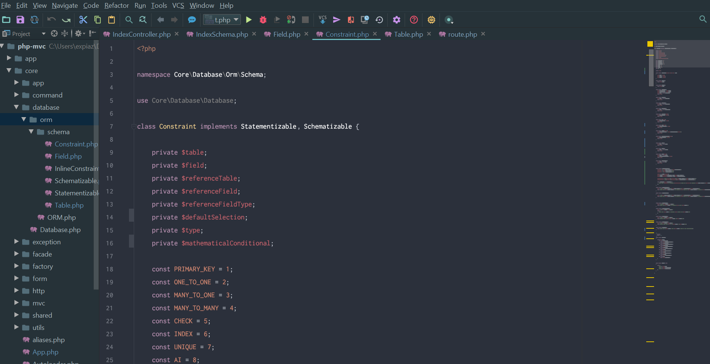
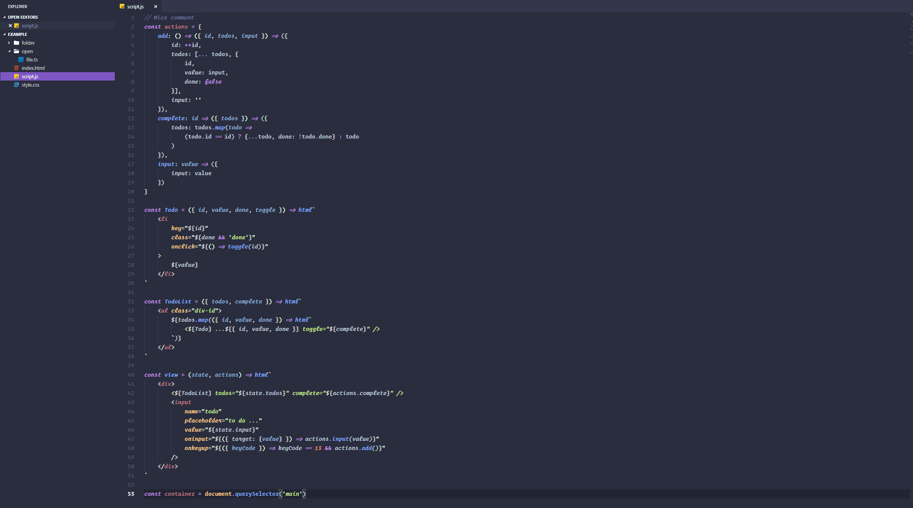

# PhPStorm :

## Theme :
[Material](https://github.com/ChrisRM/material-theme-jetbrains)

## Colors :
[Spacegray](https://github.com/abhimanyu003/phpstorm-spacegray)
+ Spacegray_Expiaz (for php/js/java)
+ Oceanic Next (normally for Js)

## Plugins:
+ [CodeGlance](https://plugins.jetbrains.com/plugin/7275-codeglance) for minimap

## Fonts:
+ [Inconsolata](http://www.levien.com/type/myfonts/inconsolata.html) in 18 ~ 20 / 14 ~ 16 for console
    + Ligatures
+ [Operator](https://www.typography.com/fonts/operator/styles/operatormonoscreensmart)
	+ Ligatures

## Example:



# VSCode

## Theme :
[Material Theme](https://marketplace.visualstudio.com/items?itemName=Equinusocio.vsc-material-theme)
[Material Icons](https://marketplace.visualstudio.com/items?itemName=PKief.material-icon-theme)

## Colors :
[Custom Scheme](./vscode/settings.json) based on [Palenight Operator](https://marketplace.visualstudio.com/items?itemName=whizkydee.material-palenight-theme) :
+ different fonts (Operator & Inconsolata for ligatures)
+ unified colors
+ remove color bugs in template literal (functions mostly)

## Fonts :
+ [Inconsolata](http://www.levien.com/type/myfonts/inconsolata.html)
+ [Operator](https://www.typography.com/fonts/operator/styles/operatormonoscreensmart)

## Extensions :
+ [lit-html](https://marketplace.visualstudio.com/items?itemName=bierner.lit-html) for html templates highlight
_(deprecated)_
+ [Custom CSS and JS Loader](https://marketplace.visualstudio.com/items?itemName=be5invis.vscode-custom-css) for multiples fonts 

## Edition :
+ Extract colors of a theme by `Ctrl + Shift + P` search `Developer : Generate Color Theme`
+ `Ctrl + Shift + P` search `Developer : Inspect TM Scopes` to find token scopes
+ Edit `settings.json` and add the rules into `[Palenight Operator]::textMateRules`
+ enjoy !

## Steps :
+ Install `Material Theme` & `Material Icons`
+ `Ctrl + Shift + P` search `Material` then `enable arrows` `change folder color` to white & restart
+ Reset `accent color` if doesn't apply
+ Install `Material Palenight` then `Ctrl + Shift + p` search `Preference Color Theme` and choose `Palenight Operator`
+ Add custom color scheme in `settings.json` under `[Palenight Operator]`

_deprecated_
+ Install `Custom CSS and JS Loader` and add `vscode_custom_css.imports` css file path in `settings.json` (file://C:/...)
+ Create CSS file and add this rule :
```css
    /* => <= >= !== === */
    .mtk30 {
        font-family: "Inconsolata";
    }
    /* // /* */
    .mtk7 {
        font-family: "Inconsolata";
    }
```

## Example :



# Operator Mono Lig

1. Get [Operator](https://www.typography.com/fonts/operator/styles/operatormonoscreensmart)
2. Get [Operator Mono Lig](https://github.com/kiliman/operator-mono-lig)
3. Install `Operator Mono Lig Book` / `Operator Mono Lig Book Light`
4. `Ctrl + Shift + P` search `settings` and edit `settings.json`
5. Change font family to `Operator Mono Lig Light` on Windows (names differs because of a bug) and `Operator Mono Book Light` on Linux/Mac
6. If you want, you can use the predefined settings for `Operator Mono Lig` from [settings.json](./vscode/operator.lig.json)